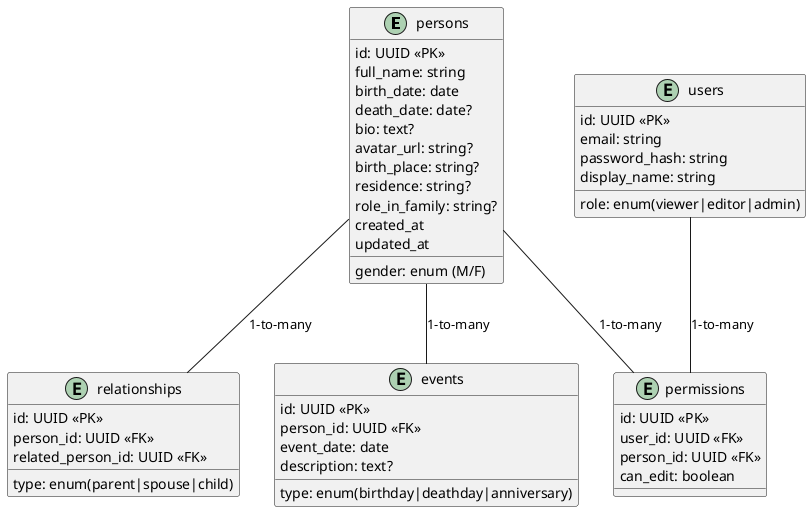

# SPEC-1-FamilyTreeApp

## Background

Theo truyền thống văn hóa Việt Nam, việc duy trì và phát triển Gia phả không chỉ mang ý nghĩa lưu giữ nguồn cội mà còn là một phương tiện giáo dục con cháu về truyền thống dòng họ. Tuy nhiên, hình thức ghi chép thủ công hiện nay đang đối mặt với nhiều hạn chế: khó cập nhật, dễ thất lạc, và thiếu tính trực quan khi tra cứu.

Ứng dụng "Quản lý Gia phả dòng tộc" được thiết kế nhằm mục tiêu hiện đại hóa quá trình này bằng cách số hóa dữ liệu gia phả, giúp các thành viên trong dòng họ dễ dàng cập nhật, tra cứu và bảo tồn thông tin thế hệ một cách lâu dài và khoa học. Ứng dụng sẽ hỗ trợ hiển thị cây phả hệ dạng sơ đồ, quản lý chi tiết thông tin từng thành viên, lịch sự kiện liên quan đến dòng họ và đồng bộ hóa dữ liệu giữa nhiều thành viên trong họ.

Tốt! Dựa theo mô tả chức năng bạn đã đưa ra, mình đã phân loại các yêu cầu theo mô hình **MoSCoW** (Must have, Should have, Could have, Won’t have for now). Dưới đây là phần **Requirements**:

## Requirements

### ✅ Must Have (Bắt buộc phải có)

* Quản lý thông tin thành viên:

  * Họ tên, ngày sinh, ngày mất
  * Giới tính, nghề nghiệp
  * Ảnh đại diện
  * Tiểu sử, nơi sinh, nơi cư trú
  * Vai trò trong dòng tộc (trưởng họ, người thờ cúng,…)
* Quản lý mối quan hệ:

  * Cha – mẹ – con, vợ/chồng
  * Hiển thị cây gia phả dạng sơ đồ
* Tìm kiếm và lọc thông tin:

  * Theo tên, năm sinh, giới tính, dòng chi
* Lưu trữ dữ liệu:

  * Dữ liệu cục bộ hoặc trên cloud
  * Đồng bộ giữa các thành viên (qua phân quyền)
* Hỗ trợ đa nền tảng (Web là chính, mobile hỗ trợ cơ bản)
* Giao diện đơn giản, thân thiện với người lớn tuổi
* Chế độ xem offline (có bộ đệm dữ liệu)

### ✅ Should Have (Nên có)

* Tính năng tìm quan hệ: "Ông A là gì của tôi?"
* Lưu trữ và xuất bản:

  * Xuất ra PDF/ảnh để in
* Quản lý sự kiện:

  * Sinh nhật, ngày giỗ, lịch nhắc
  * Gửi thông báo qua email/app
* Phân quyền người dùng:

  * Người xem, người chỉnh sửa, quản trị viên

### ✅ Could Have (Có thể có sau này)

* Ghi âm lời kể của người lớn tuổi
* Hệ thống chỉnh sửa có nhật ký (audit log)
* Lưu trữ tài liệu dòng họ (văn tế, di chúc…)
* Tích hợp bản đồ hiển thị nơi sống/sinh/tử
* In khổ lớn có thể cuộn

### ❌ Won’t Have (Chưa làm ở phiên bản đầu)

* Tích hợp AI tìm quan hệ tự động
* Nhận dạng ảnh chân dung

## Method 

1. Tổng quan kiến trúc
2. Thiết kế cơ sở dữ liệu
3. Thuật toán suy diễn mối quan hệ
4. Thành phần giao diện và backend

---

### 🎯 Bước 1: Kiến trúc tổng quan (version MVP)

Mình đề xuất sử dụng kiến trúc **Web + Cloud-based** đơn giản, dễ triển khai, dễ mở rộng:

```plaintext
Client (Web) --> API Gateway --> App Server (Node.js/Python) --> Database (PostgreSQL) + Storage (S3)
                                                  |
                                                  --> Auth Server (Firebase Auth / Supabase)
```

#### 🔧 Công nghệ đề xuất:

| Thành phần     | Công nghệ                                           |
| -------------- | --------------------------------------------------- |
| Frontend       | React + Tailwind CSS                                |
| Backend API    | Node.js + Express (hoặc NestJS)                     |
| Database       | PostgreSQL (quan hệ + JSON)                         |
| File Storage   | AWS S3 hoặc Supabase Storage                        |
| Auth           | Firebase Auth hoặc Supabase Auth                    |
| Tree Rendering | `d3.js` (dạng tree layout) hoặc `react-family-tree` |

---

### ✅ PlantUML sơ đồ tổng quan kiến trúc (Deployment View)

```plantuml
@startuml
actor User
User -> WebApp : Sử dụng
WebApp -> API : Gửi yêu cầu
API -> AuthService : Xác thực
API -> PostgreSQL : Lưu thông tin
API -> FileStorage : Lưu ảnh, file
WebApp -> TreeRenderer : Vẽ cây phả hệ

database PostgreSQL
database FileStorage
component API
component AuthService
component WebApp
component TreeRenderer

@enduml
```

---

## 🎯 Bước 2: Thiết kế cơ sở dữ liệu

### 🔑 Các bảng chính:

```plaintext
1. persons         -- Thông tin từng thành viên
2. relationships   -- Liên kết huyết thống và hôn nhân
3. events          -- Các sự kiện (sinh nhật, giỗ...)
4. users           -- Tài khoản người dùng
5. permissions     -- Phân quyền chỉnh sửa/xem
6. files           -- Ảnh và tài liệu liên quan
```

---

### ✅ Sơ đồ CSDL đơn giản (ERD)



---

### 📌 Lưu ý đặc biệt:

* `relationships` là bảng quan hệ **2 chiều**:

  * Ví dụ: A là **cha** của B → A → B (type: parent)
  * B là **con** của A → B → A (type: child)
  * Ta có thể lưu **cả 2 dòng quan hệ** nếu cần truy vấn nhanh hơn.

---

## 🎯 Bước 3: Thiết kế thuật toán suy diễn mối quan hệ

### ✅ Mục tiêu:

Tìm đường đi từ một người đến người khác trong cây phả hệ qua quan hệ `parent`, `child`, `spouse`, sau đó **dịch đường đi đó thành quan hệ** (ví dụ: cha → cha → con = ông nội).

---

### 📌 Ý tưởng giải thuật:

1. **Biểu diễn cây gia phả như đồ thị định hướng**:

   * Đỉnh: `persons`
   * Cạnh: `relationships` (có nhãn: parent, child, spouse)

2. **Duyệt theo BFS/DFS** từ người nguồn (user), tìm đường đến người đích.

3. **Dịch đường đi (path)** thành quan hệ ngôn ngữ.

---

### ✅ Pseudocode thuật toán BFS:

```python
def find_relationship_path(graph, source_id, target_id):
    queue = [(source_id, [])]
    visited = set()

    while queue:
        current, path = queue.pop(0)
        if current == target_id:
            return path
        
        visited.add(current)
        for neighbor, relation in graph.get(current, []):
            if neighbor not in visited:
                queue.append((neighbor, path + [relation]))
    
    return None
```

---

### 🧠 Dịch quan hệ (rule engine):

Với mỗi chuỗi quan hệ, ta dùng rule mapping:

| Chuỗi quan hệ            | Kết luận         |
| ------------------------ | ---------------- |
| parent → parent          | ông/bà nội/ngoại |
| parent → sibling → child | anh/chị em họ    |
| child → child            | cháu             |
| spouse                   | vợ/chồng         |
| parent → spouse          | mẹ kế/cha dượng  |

Có thể sử dụng **tree grammar** hoặc **rule tree** nếu phức tạp hơn.

---

### ✅ Ví dụ minh họa:

```plaintext
Tôi (ID: 1)
-> parent (ID: 2)
-> parent (ID: 3)
==> 3 là ông nội của tôi
```

---

## 🎯 Bước 4: Frontend & Backend Components

### ✅ 1. Frontend Components (React-based)

| Component            | Mô tả chức năng                                                 |
| -------------------- | --------------------------------------------------------------- |
| `FamilyTreeView`     | Hiển thị cây phả hệ bằng sơ đồ (d3.js hoặc `react-family-tree`) |
| `PersonProfile`      | Trang chi tiết 1 thành viên                                     |
| `PersonForm`         | Thêm/sửa thông tin thành viên                                   |
| `SearchBar`          | Tìm kiếm theo tên, năm sinh,...                                 |
| `RelationshipFinder` | Giao diện truy vấn "Người A là gì của tôi?"                     |
| `EventCalendar`      | Hiển thị lịch sự kiện dòng họ                                   |
| `FileUpload`         | Giao diện tải ảnh, tài liệu                                     |
| `Login/Register`     | Đăng nhập, đăng ký tài khoản                                    |
| `AdminPanel`         | Quản lý quyền, nhật ký chỉnh sửa                                |

---

### ✅ 2. Backend API Endpoints (REST hoặc GraphQL)

| Endpoint                 | Phương thức         | Chức năng                        |
| ------------------------ | ------------------- | -------------------------------- |
| `/api/persons`           | GET/POST/PUT/DELETE | Quản lý thành viên               |
| `/api/relationships`     | POST/DELETE         | Tạo quan hệ cha – con – vợ chồng |
| `/api/search`            | GET                 | Tìm kiếm thành viên              |
| `/api/relationship-path` | GET                 | Truy xuất quan hệ giữa hai người |
| `/api/events`            | GET/POST            | Tạo và lấy sự kiện               |
| `/api/files/upload`      | POST                | Tải ảnh, file                    |
| `/api/auth`              | POST                | Xác thực tài khoản               |
| `/api/permissions`       | GET/POST            | Phân quyền theo người dùng       |
| `/api/export`            | GET                 | Xuất cây gia phả ra PDF/Ảnh      |

---

### ✅ Deployment Suggestion (dev/staging/prod)

* **Local dev**: Docker Compose (PostgreSQL + Node + React)
* **Staging/Production**:

  * Frontend: Vercel / Netlify
  * Backend: Render / Railway / Supabase Edge Functions
  * DB: Supabase PostgreSQL
  * File Storage: Supabase / S3-compatible

---
